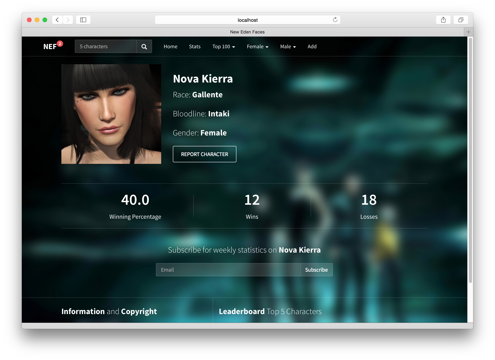

# Demo-VotingApp

使用React、Node.js、MongoDB、Socket.IO开发一个角色投票应用。

参考文章：

- [中文翻译](http://www.kancloud.cn/kancloud/create-voting-app/63976)
- [英文原文](http://sahatyalkabov.com/create-a-character-voting-app-using-react-nodejs-mongodb-and-socketio/)

针对各个模块最新版本对代码进行优化，使用ES6等特性，升级 `react`: 15.4 、`alt`:0.18.6 等

最新库列表：[package.json](package.json)

